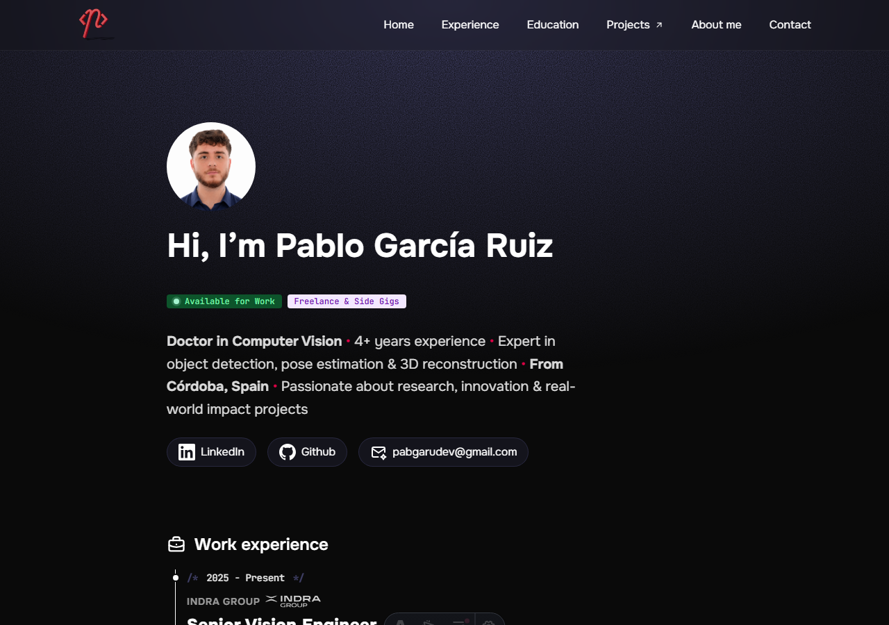

# Pablo García Ruiz — Portfolio

Personal site built with [Astro](https://astro.build) and [Tailwind CSS](https://tailwindcss.com), showcasing my work in computer vision research and engineering.

🔗 **Live:** [pablogarciaruiz.com](https://www.pablogarciaruiz.com)



## Stack

- [Astro](https://astro.build) — static site generation
- [Tailwind CSS](https://tailwindcss.com) — styling
- [Vercel Analytics](https://vercel.com/analytics) — traffic insights

## Getting started

```sh
npm install
npm run dev       # start local dev server
npm run build     # build for production
npm run preview   # preview the production build
```

## License

[MIT](LICENSE)
