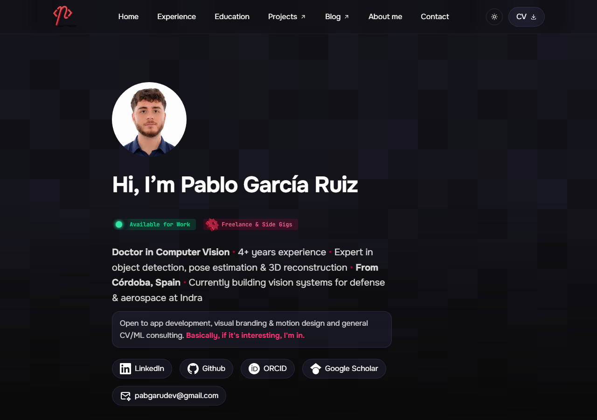

# Pablo García Ruiz, Portfolio

Personal site and portfolio for **Pablo García Ruiz**, PhD in Computer Vision. It showcases research papers, my doctoral thesis, side projects, and professional experience in object detection, pose estimation, and 3D reconstruction, along with the info to get in touch for freelance and side gigs.

🔗 **Live:** [pablogarciaruiz.com](https://www.pablogarciaruiz.com)



[](https://astro.build)
[](https://tailwindcss.com)
[](https://www.typescriptlang.org)
[](https://threejs.org)
[](https://vercel.com)
[](LICENSE)

## Stack

- [Astro 7](https://astro.build), static pages plus on-demand endpoints, content collections, and view transitions
- [Tailwind CSS 4](https://tailwindcss.com), utility-first styling with a manual, persisted light/dark theme
- [TypeScript](https://www.typescriptlang.org), typed component props and client scripts
- [MDX](https://mdxjs.com), blog posts as a content collection, with a generated RSS feed and sitemap
- [three.js](https://threejs.org), WebGL section-heading icons and small decorative meshes, each with a flat-icon and reduced-motion fallback
- [Resend](https://resend.com), transactional email behind the `/api/contact` form (honeypot plus server-side validation)
- [Vercel](https://vercel.com), hosting, the Astro adapter, and privacy-friendly analytics
- Security headers (CSP, HSTS, and the rest) set in `vercel.json`, plus JSON-LD structured data on every page

## Getting started

```sh
npm install
npm run dev                # local dev server
npm run build              # production build into dist/
npx serve dist/client      # serve the build locally (the Vercel adapter has no `astro preview`)
```

For the contact form, copy `.env.example` to `.env` and set `RESEND_API_KEY` (and optionally `CONTACT_TO_EMAIL`). In Vercel, set the same values under Project Settings, Environment Variables.

## Quality checks

CI runs on every push and pull request (`.github/workflows/ci.yml`):

- `npm run build`
- Lighthouse CI, with budgets for accessibility, SEO, best practices, and performance
- Pa11y CI, an axe accessibility pass over the key routes (advisory only, see the workflow comment for why)

## License

Code is licensed under [MIT](LICENSE). Content (text, images, research write-ups) is © Pablo García Ruiz.
